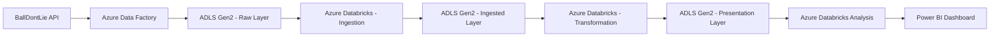

# NBA Data Engineering Pipeline

## Project Overview

This project demonstrates an end-to-end Azure Data Engineering pipeline using NBA data from the BallDontLie API.

The pipeline follows the Medallion Architecture by organizing data into Raw, Ingested, and Presentation layers stored in Azure Data Lake Storage Gen2. Azure Data Factory orchestrates data ingestion, Azure Databricks performs transformations using PySpark, and Power BI is used for reporting and visualization.

---

## Objectives

- Extract NBA data from the BallDontLie API.
- Store raw API data in Azure Data Lake Storage Gen2.
- Build scalable ingestion and transformation pipelines using Azure Databricks.
- Organize data using Raw, Ingested, and Presentation layers.
- Create analytical dashboards in Power BI.

---

## Architecture



---

## Project Structure

```text
nba-data-engineering-pipeline/

├── adf/
├── configs/
├── databricks/
├── docs/
├── powerbi/
├── src/
├── tests/
├── requirements.txt
└── README.md
```

---

## Technology Stack

- Python
- Git & GitHub
- BallDontLie API
- Azure Data Factory
- Azure Data Lake Storage Gen2
- Azure Databricks
- Delta Lake
- PySpark
- Power BI

---

## Prerequisites

- Python 3.13+
- Git
- Visual Studio Code
- Azure Subscription
- GitHub Account
- Power BI Desktop

---

## Local Setup

1. Clone the repository.
2. Create a virtual environment.
3. Activate the virtual environment.
4. Install dependencies:

```bash
pip install -r requirements.txt
```

---

## Pipeline Execution (Planned)

1. Extract NBA data from BallDontLie API.
2. Load raw JSON into ADLS Gen2.
3. Perform ingestion using Azure Databricks.
4. Transform and clean the data.
5. Store curated datasets in the Presentation layer.
6. Build Power BI dashboards.

---

## License

This project is intended for learning and portfolio purposes.